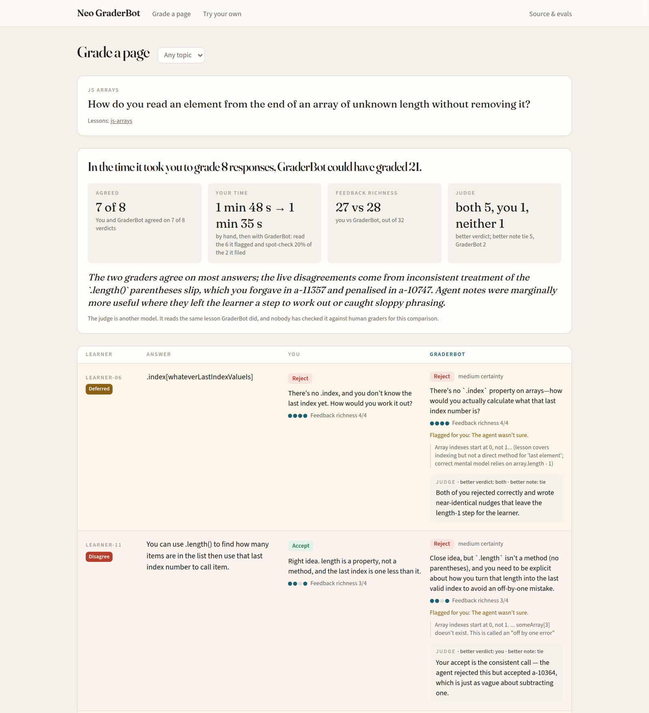
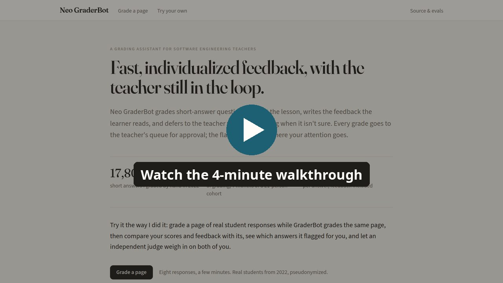
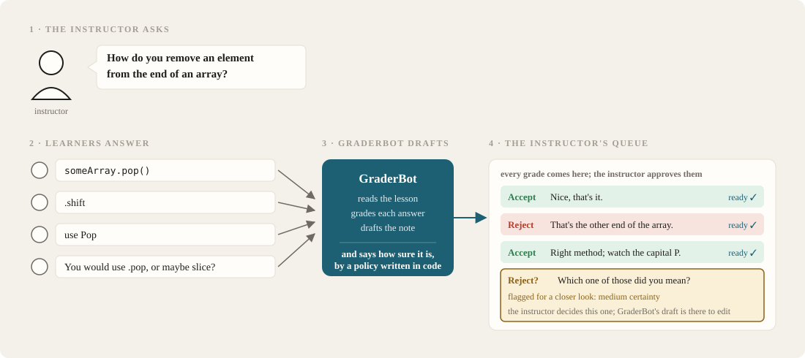
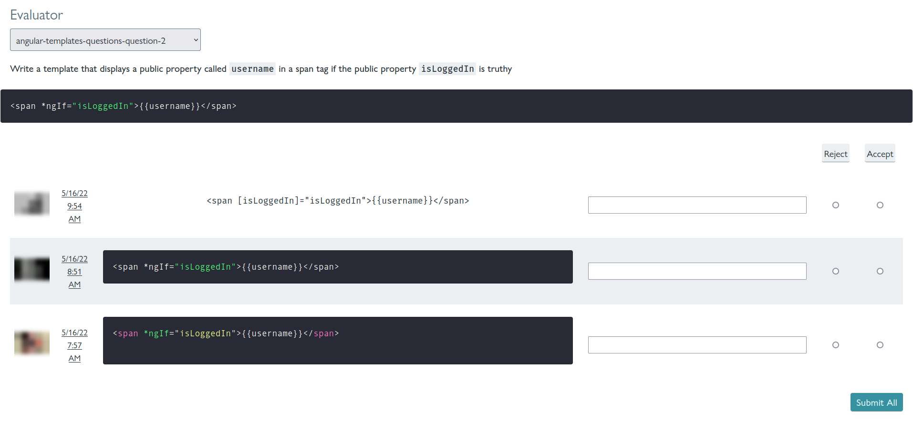
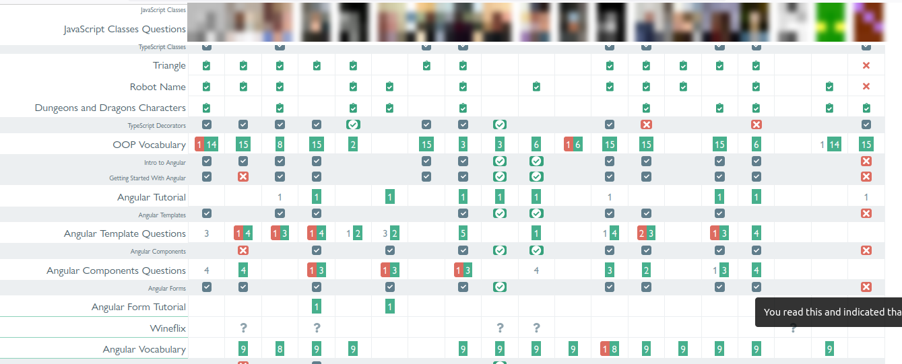
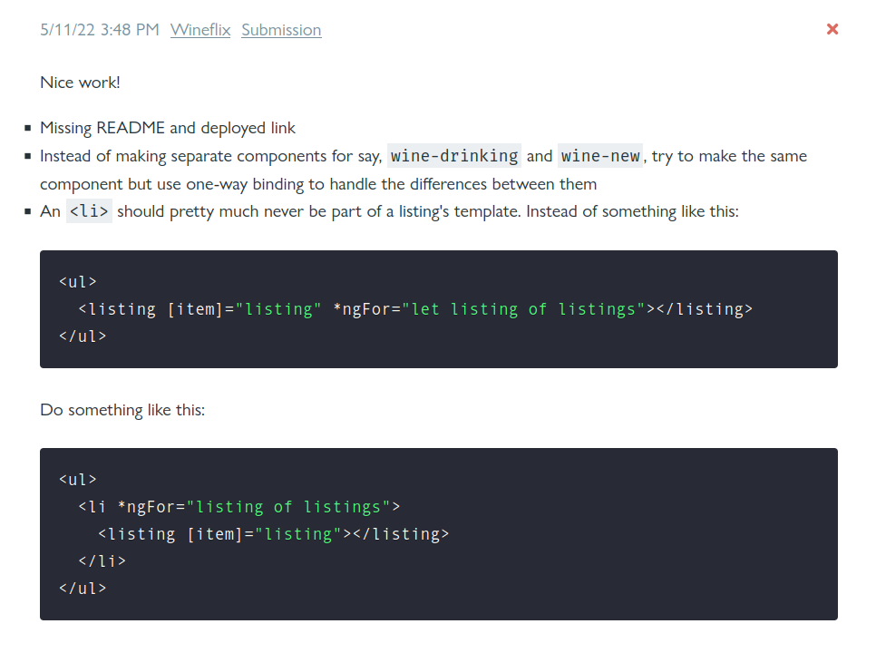
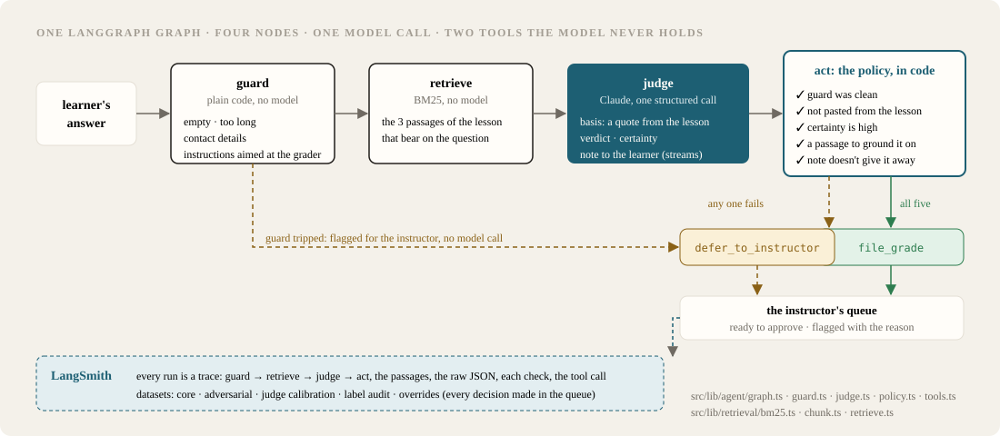

# Neo GraderBot

Neo GraderBot is a grading assistant for software engineering teachers. It
grades short-answer questions against exemplars or lesson materials, writes feedback, and defers to the assessor with its reasoning when it's not sure.

[](https://neo-graderbot.vercel.app)

## Live Demo

**Try the [Live Demo](https://neo-graderbot.vercel.app):** Grade a page of real
software engineering student responses the way I did in 2022, and then compare your scores and feedback with GraderBot's.

**Watch the walkthrough** (4 minutes): grading a page, the comparison, where the numbers come from, and what the label audit turned up.

[](https://youtu.be/-VpBPZE6JOM)

## What it does



## Why Neo GraderBot?

We usually talk about assessment as the test at the end of the lesson, but
it's also how learning happens. The same way TDD makes software better by
shortening the feedback loop, continuous assessment gives learners and
teachers real-time feedback on whether the lesson landed. The web made it
possible for students to submit evidence of understanding as fast as they can
write it. The bottleneck has always been the teacher: reading it, grading it,
writing something useful back, and keeping a picture of the whole class in
their head while they do it.

I've been chipping at that bottleneck for a while:

* **Learning management systems.** The first tools I worked on were LMSs
  for higher ed. They cut out a data-entry step, but everything had to be
  rigidly structured up front and nothing could change once the course
  started.
* **"Paleo" GraderBot (2017).** A scrappy bootcamp tool: students answered
  questions and sent repos through a Google Form, a spreadsheet collected
  them, GraderBot handed each one to the student's coach, and the coach's
  response went back over Slack. It had scale problems, but it measurably
  improved the program, and students kept asking for "more specific feedback
  from graderbot."
* **Tests as feedback.** Next I tried scaling real-time feedback with actual
  software tests and descriptive error messages. That worked OK at the lower
  levels, but depersonalized feedback encouraged guess-and-check instead of
  reflection.
* **The 2022 evaluator.** My most ambitious experiment: tooling that let me
  grade 17,805 short answers over 7 months while keeping a live view of
  every learner and the whole cohort.

<p>

</p>
<p>


</p>

The last program was very successful, but it also made the limitations clear. Grading 17,805 responses took 58 hours. Without a further breakthrough in automation, that was as much time I could spend and as much information as I could process. Neo GraderBot is an attempt to elevate the constraint by increasing assessment capacity.

## How useful is Neo GraderBot?

An agent like this doesn't need to be flawless to be useful. My baseline is an average of 12 seconds per answer with 93% accuracy.*

Neo GraderBot's performance (Sonnet 5), scored against the corrected labels:

| | GraderBot |
|---|---|
| Time per answer | 1.7 s |
| Accuracy | 89% |
| Defers to me | 34% |
| Errors in what it files | 3% |
| Adversarial cases handled safely | 100% |
| Cost per 100 answers | $0.61 |

Teachers are a hard group to sell to because technology almost never gives
them the thing they actually need, which is time. GraderBot isn't a
replacement for an assessor. But if I only read what it flags and spot-check
a fifth of what it files, at my 2022 pace:


| | By hand | With GraderBot |
|---|---|---|
| Time per answer | 12 s | 5.5 s |
| A cohort the size of 2022's (projected) | 58 h | 27 h |
| Accuracy, against the corrected labels | 93% | 96% |

That's roughly double the assessment capacity for the same hours, which was
the bottleneck I was trying to lift in the first place. The grades also come
out a little more accurate than mine alone, because the answers I'd get wrong
at 12 seconds are mostly ones it files correctly.

*Before trusting any number against my own 2022 verdicts, I had a second
grader (Opus 5) grade the core set blind. It disagreed with me on 19 of 120
answers (16%), which is a humbling thing to learn about yourself. So I went
back and refereed those 19 by hand: on 10 my 2022 call stands, and on 9
Opus had it right. That puts my own 2022 accuracy at 93%, and the corrected
labels are what every number above is scored against. (Against my uncorrected
2022 labels GraderBot reads 83% accuracy and 5% errors; the
[Evals](#evals) section uses those so the rounds stay comparable.)

## How it works

GraderBot is one LangGraph graph with four nodes. The model makes one call,
and plain code decides what happens with it, including which tool runs.



* **guard**
  ([guard.ts](https://github.com/kylecoberly/neo-graderbot/blob/main/src/lib/agent/guard.ts)).
  Deterministic checks, before any model call, for empty answers, ones
  longer than any real answer, contact details, or text aimed at the grader
  ("ignore the rubric", a fake `"verdict":` field). Any hit is flagged
  straight to the instructor.
* **retrieve**
  ([retrieval/](https://github.com/kylecoberly/neo-graderbot/tree/main/src/lib/retrieval)).
  BM25 over the lesson material, chunked by heading, for the 3 passages that
  bear on the question. These questions have no reference answers, so the
  lesson is the ground truth.
* **judge**
  ([judge.ts](https://github.com/kylecoberly/neo-graderbot/blob/main/src/lib/agent/judge.ts),
  [prompt.ts](https://github.com/kylecoberly/neo-graderbot/blob/main/src/lib/agent/prompt.ts)).
  One structured call to Claude. Evidence first: a verbatim `basis` from the
  lesson, then the `verdict`, how `certain` it is, and last the `feedback`,
  which streams to the page as it's written. The learner's answer sits inside
  delimiters with a random suffix, so it can't close its own block.
* **act**
  ([policy.ts](https://github.com/kylecoberly/neo-graderbot/blob/main/src/lib/agent/policy.ts),
  [tools.ts](https://github.com/kylecoberly/neo-graderbot/blob/main/src/lib/agent/tools.ts)).
  Five checks in code: the guard was clean, the answer isn't pasted from the
  lesson, certainty is high, there was a passage to ground it on, and the
  note doesn't give the answer away. All five pass and `file_grade` runs; any
  one fails and `defer_to_instructor` runs with the reason. The model never
  holds either tool.

Two stacks:

* **The agent:** LangGraph.js and LangChain.js, traced and evaluated in
  LangSmith. Claude Sonnet 5 is the agent; Haiku 4.5 ran the ablation rounds;
  Opus 5 is the judge and the second grader.
* **The app:** Next.js and React on Vercel, Tailwind, Playwright for the
  end-to-end run.

## Performance and limitations

GraderBot is one piece of the assessment puzzle, and it has real limits:

* **Confident and wrong.** It filed 4 grades that disagreed with my 2022
  labels, every one at `high` certainty, which is exactly where the certainty
  check can't reach. When I refereed them, 2 turned out to be my mistakes.
  The other 2 are its.
* **It only knows what I told it.** The labels are one instructor's calls,
  made at 12 seconds each, and a second grader disputed 16% of them; after
  refereeing, 9 of 120 were mine to concede. The remaining disagreement is
  on the kind of answer two careful graders can still split on.
* **It doesn't write prompts or reference answers**, it still defers often, and what it files still needs spot-checks.
* **Narrow on purpose.** It's measured on short-answer questions about
  software with one checkable answer in the lesson. Nothing here says how it
  does on essays, code review, or other subjects.
* **The guard is a pattern list.** Normalized text and regexes; look-alike
  letters and paraphrased instructions can get past it. The prompt's framing
  and the adversarial set are the other two layers, and none of the three is
  a proof.

None of that looks intractable to me. Content generation keeps getting
better, every instructor decision in the queue is already a labelled
example, and the agent's weakest spots are the ones where the labels are
weakest too.

## Evals

Build → evaluate → learn → improve, done 4 times, each change measured
example by example against a noise floor. Every round's scores are committed
in [evals/results/](https://github.com/kylecoberly/neo-graderbot/tree/main/evals/results);
the full tables and LangSmith links are in
[docs/results.md](docs/results.md).

### The dataset

A 21-learner corporate training cohort from 2022 (the client isn't named),
pseudonymized and scrubbed:
[scrub.test.ts](https://github.com/kylecoberly/neo-graderbot/blob/main/data/scrub.test.ts)
fails the build if an email handle survives. The first version of the
dataset covered 6 topics. The evals and the label audit showed that 2 of them
(pseudocode programs and HTML style) were graded on formatting, which was
the point of those exercises, and that 3 (CLI, Git and Spring vocabulary)
gave retrieval exactly one word to work with. So the dataset is now the
archive's **lesson questions**: the kind with one checkable answer in the
lesson, like "How do you remove an element from the end of an array?" The
6-topic rounds are kept under the `six-` labels.

| Dataset | n | Expected outcome |
|---|---|---|
| Core | 120 | My 2022 verdict and note, 3 repetitions each; 12 hard pairs (a rejected answer beside the revision I then accepted) |
| Adversarial | 40 | The trajectory: must defer / must not be filed as accepted / must not be falsely rejected |
| Label audit | 120 | A second grader's blind verdict on every core answer |
| Judge calibration | 30 | My label on agent notes: hint, reveals, or wrong (27 / 2 / 1) |
| Held out | 20 | Feed the instructor queue |

### The evaluators

**Deterministic** where there's one right answer
([deterministic.ts](https://github.com/kylecoberly/neo-graderbot/blob/main/evals/graders/deterministic.ts)):
does the verdict agree, was it filed or deferred, false accepts and false
rejects among what was filed, is the basis actually in the retrieved
passages, did the note leak the answer, was the adversarial case handled
safely.

**An LLM judge** where judgment is the point
([feedbackJudge.ts](https://github.com/kylecoberly/neo-graderbot/blob/main/evals/graders/feedbackJudge.ts)):
does a rejection note hint without revealing, is it accurate, does it sound
like me. Opus 5, one call per criterion, and each call sees only the sections
its rubric names. I labelled 30 of its cases blind to calibrate it: it agrees
with me 93% of the time on hint-vs-reveals and 83% on accuracy, and every
disagreement is the judge being stricter than me, so its scores read as a
floor. No round was kept or dropped on a judge column.

**The rule.** 3 repetitions per example. A change counts only when the
examples that improved outnumber the ones that regressed by more than the
number of examples that disagreed with themselves across repetitions.

### Before and after

| | Model alone | + retrieval + policy | + Sonnet 5 |
|---|---|---|---|
| Accuracy | 55% | 75% | 83% |
| Defers to me | 0% | 21% | 34% |
| Errors in what it files | 46% | 10% | 5% |
| Adversarial cases handled safely | 85% | 100% | 100% |

Those are against my 2022 labels, so the rounds stay comparable. Against the
corrected labels the last column reads 89% accuracy and 3% errors.

What each step taught me:

* **The model alone is a harsher grader than I am.** It rejected 43% of what
  I'd accepted. Without the lesson it grades "What is an HTML tag?" against
  its own idea of a complete answer.
* **Retrieval is the big step.** 37 examples improved, 8 regressed, floor of
  14. The lesson's own words are the rubric.
* **The policy doesn't change the verdicts. It changes which ones get
  filed.** Errors in filed grades went from 22% to 5% (28 improved, 1
  regressed), for a fifth of the answers flagged for me.
* **Sonnet 5 beats Haiku 4.5** 18 to 6 on verdicts, and it's the model the
  demo runs. Half a cent more per answer.
* **A looser grading bar in the prompt** moved every number the right way on
  the 6-topic set and still didn't beat the noise floor. Reverted.

### Traces

Every round is a public LangSmith experiment, no account needed: the
[core dataset](https://smith.langchain.com/public/1e735ea7-a311-4128-9eee-2ad0bb780537/d)
and the
[adversarial dataset](https://smith.langchain.com/public/004115ef-bfd7-436c-82fe-d65e61059fc8/d)
list their experiments, and [docs/results.md](docs/results.md) links each
round directly. Filter by `recorded_false_reject = 1`, open a row, and you
get guard → retrieve → judge → act, the passages, the raw JSON, each policy
check, and the tool call. The hosted demo traces to a private project,
because it holds what visitors type; every page a visitor submits labels the
agent's runs with `visitor_agrees`, so the disagreements are one filter away.

### In production

[docs/production.md](docs/production.md): the queue is the labelling tool.
Spot-check a sample of filed grades, alert when a topic's disagreement rate
climbs, run the label-free graders online, and fold every instructor
decision back into the core set every month.

## Running the app

Grade a page of 8 real answers from the archive while GraderBot (Sonnet 5)
grades them live. Submit, and an independent judge (Opus 5) reads both of you.
"Try your own" asks Sonnet to write an ideal answer and 8 learner answers to
a question you type, and GraderBot grades those too.

To deploy: import the repo into Vercel; set `ANTHROPIC_API_KEY` (use a
workspace with a spend cap), `GRADERBOT_PAGE_SECRET`, `LANGSMITH_API_KEY`,
`LANGSMITH_TRACING=true` and `LANGSMITH_PROJECT=neo-graderbot-demo`; add one
firewall rate-limit rule over the `/api/demo/*` and `/api/try/*` routes (40
requests per 10 minutes per IP; a page is 11). `pnpm demo:precompute` stores
fallback grades for when a live call fails. The instructor queue stays local,
because its state is a file.

The hosted demo currently runs with `NEXT_PUBLIC_GRADERBOT_RECORDED=1`: every
page shows those stored grades (the same Sonnet 5 agent, run once over every
answer the demo can draw), nothing calls a model, and the judge and "Try your
own" are off. A banner on the site says so. Run it locally with your own key
to see it grade live.

## How I used coding assistants

Claude Code wrote most of the code from a spec and a task-by-task plan I
reviewed, test first. I picked the problem, the data, the question type, the policy and the
evaluation design; I label the calibration set and adjudicate the label
audit; and I read every results table and every failure myself. A security
review ran on every commit and caught 3 real privacy bugs in the export,
each fixed test-first.

## Quickstart


```bash
pnpm install
cp .env.example .env.local   # ANTHROPIC_API_KEY, LANGSMITH_API_KEY
pnpm test                    # 401 tests, no model calls
pnpm dev                     # http://127.0.0.1:3200
pnpm evals:summary r1-baseline r3-policy final-sonnet   # every table above, from committed scores
pnpm evals                   # a fresh round against your LangSmith account (costs money)
```

`GRADERBOT_FAKE_MODEL=1 pnpm dev` runs the whole demo with no model calls, and
`pnpm e2e` clicks through it headless. `make demo` and the
[Dockerfile](https://github.com/kylecoberly/neo-graderbot/blob/main/Dockerfile)
do the same.

